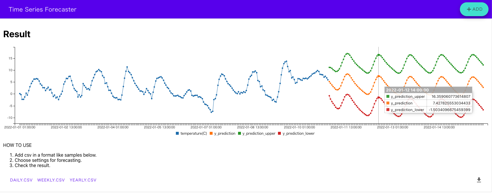
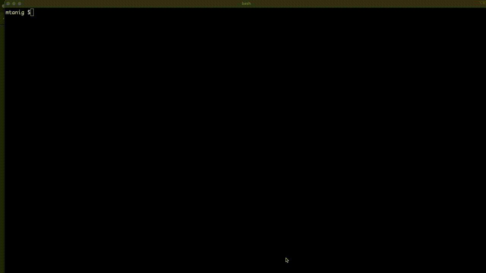

# Time Series Forecaster
[](https://github.com/mtanig/time-series-forecaster/blob/master/LICENSE)

Time Series Forecaster is an easy to use ui-based forecaster.



## How to use


### 1. Start application
#### - With Docker (Recommend)
Execute the following command after starting docker.
```
make start
```

#### - Without Docker
In each terminal, do each of the following.
##### api
```
// Just the first one
make install-api 

make start-api-without-docker
```

##### ui
```
// Just the first one
make install-ui

make start-ui-without-docker
```

### 2. Open the url in your browser and use it
```
http://localhost
```

### 3. Stop application
#### - With Docker
```
make stop
```

#### - Without Docker
In each terminal, press Ctrl-C to stop the server.
